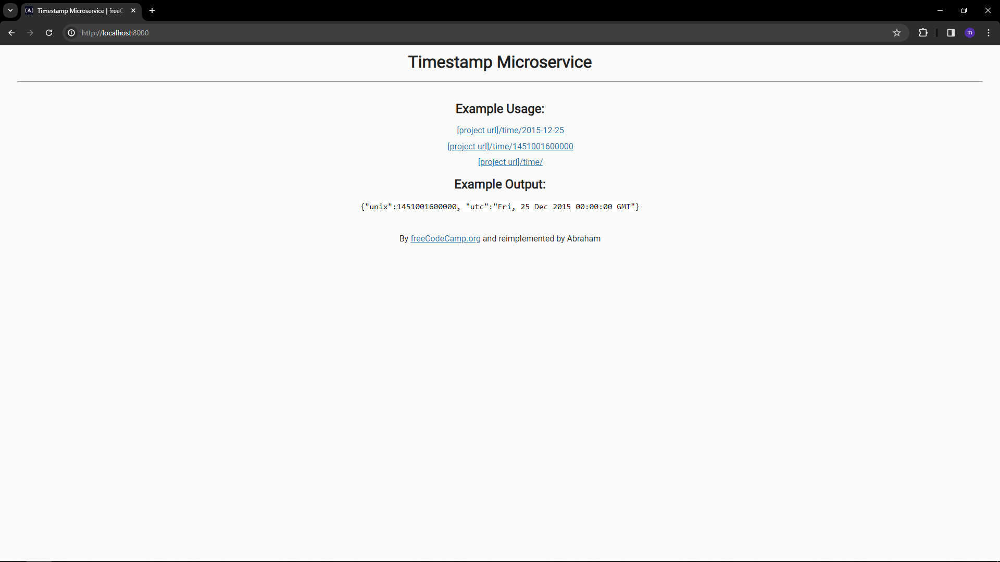

<h1>Time API</h1>

This is a simple code from <a href="www.freecodecamp.com">freecodecamp</a>. but I change the folder structure (MVC without model). I also added some test to it

<h2>Follow these steps to run this project</h2>
<ol>
<li>Git Clone the project</li>
<li>run: npm install</li>
<li>run: npm run watch</li>
<ol>

<h3>TO USE</h3>
1. Run the project
2. Click the link
3. Enjoy (if you want to)
<h3>NOTES</h3>
- Make sure you have node installed
- to run test, type: npm run test
